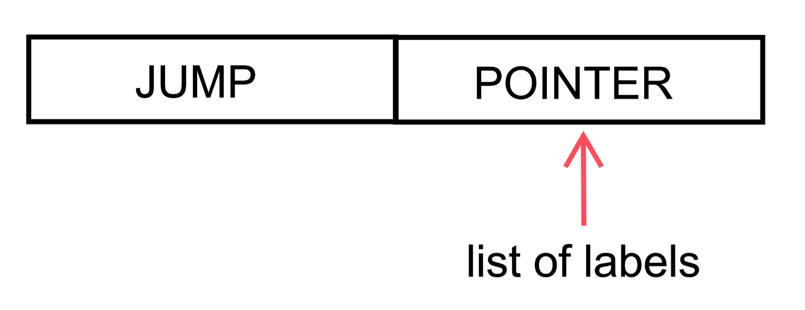

# CPU 
## My own small processor. It even has video memory, stack & graphics!!!
## Content:
- [Some aspects of implementation](#some-aspects-of-implementation)
- [Commands](#commands)
- [ASM code](#asm-code)
	- [fib - prints fibonacci numbers](#fib-------prints-fibonacci-numbers)
	- [input - with video](#input-----with-video)
 	- [nvideo - withot any video features](#nvideo----withot-any-video-features)
	- [qdr - solves quadratic equation](#qdr-------solves-quadratic-equation)
## Some aspects of implementation
* If you use the jump label (where to go) before specifying this jump location, then DOUBLE ASSEMBLY will be done. Because during the assembly process, a list of all the labels in the code is compiled.\
\
 That is, when reassembling, the missing arguments of the transition commands will be substituted.
 
 <p align="center">
	
<p>

* Use the label where to jump like: \
``NAME_OF_LABEL :``

* When displaying an image on the screen, it is allowed to recolor the shaded pixels.

* Description of all procedures is allowed only after the entire program. If another procedure is called from an executable procedure, then they must be placed in a hierarchical order. \
 \
 **Сalling scheme:** ``proc_1 --> proc_2 --> proc_3`` \
 \
 **Code scheme:** \
 ``proc_1``\
 ``proc_2``\
 ``proc_3``

>[Back to Content](#content)
## Commands
### ``PUSH`` - put it on the stack
- NUMBER: ``PUSH 2`` 
- REGISTER: ``PUSH AX``
- PUSH FROM THE ADDRESS: ``PUSH [2]`` ``PUSH [AX]``
- - - 
### ``POP``- get it from the stack
- REGISTER: ``POP AX``
- POP TO THE ADDRESS: ``POP [2]`` ``POP [AX]``
- - - 
### ``CALL`` - call the procedure
- - - 
### ``OUT`` - finish the procedure, go back
- - - 
#### JUMPS
- ``JMP`` &mdash; ``unconditional``
- ``JA`` &mdash; ``>``
- ``JB`` &mdash; ``<``
- ``JAL`` &mdash; ``>=``
- ``JBL`` &mdash; ``<=``
- ``JE`` &mdash; ``==``
- ``JNL`` &mdash; ``!=``
- - - 
### ``PVM`` - put in the video memory segment
**Arguments:** &nbsp;&nbsp;{ ``X`` ``Y`` ``R`` &nbsp; ``G``  ``B`` } \
**Example:** ``PVM`` ``10 1 255 100 0`` \
\
``X`` ``Y`` - position of pixel\
``R`` ``G`` ``B`` - Red Green Blue ( range is  [0, 255] )
- - - 
### ``SHOW`` - display the entire segment of video memory
- - - 
### ``RET`` - the end of asm program (there may be several)
- - -
### ``HLT`` - the logical end of the program 

* the processor stops executing
* you are required to use at the end of the program
- - -
>[Back to Content](#content)
## ASM code
### fib    -  prints fibonacci numbers
```
PUSH 8
PUSH 1
PUSH 0
PUSH 1
PUSH 0

POP ax
POP bx
POP cx
POP dx
POP ex

CALL FED
HLT

FED:
PUSH bx
PUSH bx
PUSH bx
PUSH ax

ADD

POP bx
POP ax
PUSH bx
OUT

PUSH cx
PUSH dx
ADD

POP cx
PUSH cx
PUSH ex

JBL JO

CALL FED

JO:
RET
```
>[Back to Content](#content)
- - -
### input  -  with video

```
PUSH 1
PUSH 3
PUSH 9

PVM 10 0 230 110 30
PVM 10 1 255 100 0
PVM 10 2 230  90 30
PVM 10 3 255  80 0
PVM 10 4 230  70 30
PVM 10 5 255  65 0
PVM 10 6 230  60 30
PVM 10 7 255  55 0
PVM 10 8 230  50 30
PVM 11 4 255  45 0
PVM 12 4 230  40 30
PVM 13 4 230  35 0
PVM 14 4 255  30 30
PVM 15 4 230  25 0
PVM 16 0 255  20 30
PVM 16 1 230  15 0
PVM 16 2 230  10 30
PVM 16 3 230   5 0
PVM 16 4 230   0 30
PVM 16 5 230   0 30
PVM 16 6 230   0 60
PVM 16 7 230   0 90
PVM 16 8 255   0 120


PVM 19 4 255 128 0
PVM 20 4 255 128 0
PVM 21 4 255 128 0
PVM 22 4 255 128 0
PVM 19 4 255 128 0
PVM 19 0 255 128 0
PVM 19 1 255 128 0
PVM 19 2 255 128 0
PVM 19 3 255 128 0
PVM 19 4 255 128 0
PVM 19 5 255 128 0
PVM 19 6 255 128 0
PVM 19 7 255 128 0
PVM 19 8 255 128 0
PVM 20 8 255 128 0
PVM 21 8 255 128 0
PVM 22 8 255 128 0
PVM 19 8 255 128 0

PVM 19 0 255 128 0
PVM 20 0 255 128 0
PVM 21 0 255 128 0
PVM 22 0 255 128 0
PVM 19 0 255 128 0

PVM 25 0 255 128 20
PVM 25 1 255 128 40
PVM 25 2 255 128 60
PVM 25 3 255 128 80
PVM 25 4 255 128 100
PVM 25 5 255 128 120
PVM 25 6 255 128 140
PVM 25 7 255 128 160
PVM 25 8 255 128 180
PVM 26 8 255 128 200
PVM 27 8 255 128 220

PVM 30 0  220   10 255
PVM 30 1  240   20 255
PVM 30 2  170   30 255
PVM 30 3  150   40 255
PVM 30 4  130   50 255
PVM 30 5  120   60 255
PVM 30 6  140   70 255
PVM 30 7  160   80 255
PVM 30 8  180   90 255
PVM 30 8  200  100 255
PVM 31 8  220  110 255
PVM 32 8  240  120 255

PVM 10 0 230 110 30
PVM 10 1 255 100 60
PVM 10 2 230  90 90
PVM 10 3 255  80 120
PVM 10 4 230  70 150
PVM 10 5 255  65 180
PVM 10 6 230  60 210
PVM 10 7 255  55 240
PVM 10 8 230  50 250
PVM 11 4 255  45 230
PVM 12 4 230  40 210
PVM 13 4 230  35 190
PVM 14 4 255  30 170
PVM 15 4 230  25 150
PVM 16 0 255  20 130
PVM 16 1 230  15 110
PVM 16 2 230  10  90
PVM 16 3 230   5  70
PVM 16 4 230   0  50
PVM 16 5 230   0  30
PVM 16 6 230   0  20
PVM 16 7 230   0  10
PVM 16 8 255   0   5

PVM 10 10 255   0    5
PVM 11 10 255   0   10
PVM 12 10 255   0   15
PVM 13 10 255   0   20
PVM 14 10 255   0   30
PVM 15 10 255   0   40
PVM 16 10 255   0   50
PVM 17 10 255   0   60
PVM 18 10 255   0   70
PVM 19 10 255   0   80
PVM 20 10 255   0   90
PVM 21 10 255   0   120
PVM 22 10 255   0   140
PVM 23 10 255   0   160
PVM 24 10 255   0   180
PVM 25 10 255   0   200
PVM 26 10 255   0   220
PVM 27 10 255   0   240
PVM 28 10 255   0   255
PVM 29 10 255   10   255
PVM 30 10 255   20   255
PVM 31 10 255   30   255
PVM 32 10 255   40   255

PVM 10 10   0     0    0
PVM 11 10  10    10   10
PVM 12 10  20    20   20
PVM 13 10  30    30   30
PVM 14 10  40    40   40
PVM 15 10  50    50  50
PVM 16 10  60    60  60
PVM 17 10  70    70  70
PVM 18 10  80    80  80
PVM 19 10  90    90  90
PVM 20 10 100   100  100
PVM 21 10 120   120  120
PVM 22 10 160   160  160
PVM 23 10 180   180  180
PVM 24 10 200   200  200
PVM 25 10 220   220  220
PVM 26 10 240   240  240
PVM 27 10 255   255  255
PVM 28 10 255   255  255
PVM 29 10 255   255  255
PVM 30 10 255   255  255
PVM 31 10 255   255  255
PVM 32 10 255   255  255

CALL fun

SHOW
HLT

fun:
POP ax
PUSH ax
PUSH ax
POP [ax]

ADD
ADD
OUT

RET
```
>[Back to Content](#content)
- - -
### nvideo -  withot any video features
```
PUSH 1
PUSH 3
PUSH 10

CALL fun
HLT

fun:
POP ax
PUSH ax
PUSH ax
POP [ax]

ADD
ADD
OUT

RET
```
>[Back to Content](#content)
- - -
### qdr    -  solves quadratic equation
```

PUSH 2
PUSH 0
PUSH 0
PUSH -13
PUSH 2

POP ax
POP bx
POP cx
POP dx
POP ex

CALL qdr
HLT

qdr:
PUSH bx
PUSH dx
SUB

POP bx
PUSH ax
PUSH ex
MUL

PUSH bx
PUSH bx
MUL

PUSH ex
PUSH ex
PUSH ax
PUSH cx
MUL
MUL
MUL

PUSH 0
SUB
ADD

PUSH 0
POP [1]
POP [2]

PUSH [2]
PUSH [2]
PUSH [1]

JA go

SQRT

POP dx
PUSH dx
PUSH bx
ADD

POP cx
POP ex

PUSH ex
PUSH cx
DIV

OUT

PUSH ex
PUSH dx 
PUSH 2
MUL

PUSH 0
SUB
PUSH cx
ADD
DIV

OUT

go:
RET
```
>[Back to Content](#content)
## ©Copyright
<p align="center">
	
	
<p>
